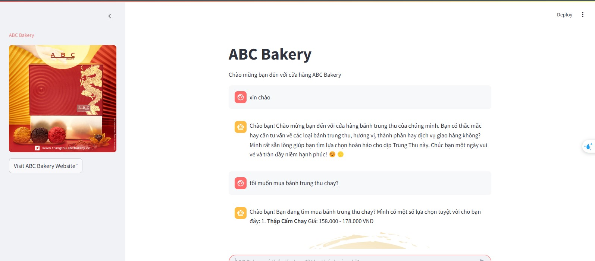
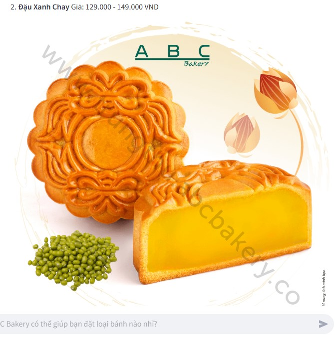
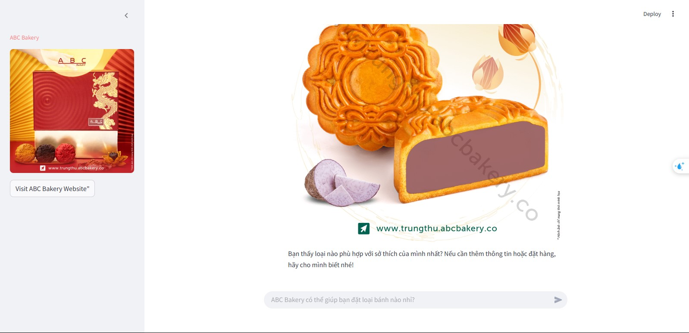

# RAG Bot Demo

## Giới thiệu
Dự án này là một chatbot demo, sử dụng các công nghệ tiên tiến như Scrapy, OpenAI, Streamlit, ChromaDB và Flask. Chatbot có khả năng cung cấp thông tin về sản phẩm và trả lời các câu hỏi chitchat thông qua giao diện web. Nó tích hợp **Retrieval-Augmented Generation (RAG)** và **Semantic Router** để xử lý truy vấn của người dùng một cách hiệu quả.

Mục tiêu của dự án là tạo ra một trợ lý ảo thông minh, có thể:
- Trả lời các câu hỏi liên quan đến sản phẩm dựa trên dữ liệu thu thập.
- Hỗ trợ trò chuyện thông thường (chitchat) với người dùng.

## Công nghệ sử dụng
Dự án sử dụng các công nghệ sau:
- **Scrapy**: Công cụ thu thập dữ liệu từ các website.
- **OpenAI**: Sử dụng mô hình ngôn ngữ lớn (LLM) như GPT-3.5-Turbo để tạo câu trả lời.
- **Streamlit**: Xây dựng giao diện web đơn giản và thân thiện với người dùng.
- **ChromaDB**: Cơ sở dữ liệu vector để lưu trữ và tìm kiếm dữ liệu nhúng (embeddings).
- **Flask**: Triển khai API backend để xử lý truy vấn và phản hồi.

## Cấu trúc hệ thống
Hệ thống chatbot bao gồm các thành phần chính sau:
1. **OpenAI Client và Embedding Model**:
   - Gọi API OpenAI để tạo câu trả lời.
   - Sử dụng mô hình nhúng (Sentence Transformer) để tạo vector từ văn bản.
2. **ChromaDB - Vector Database**:
   - Lưu trữ dữ liệu sản phẩm dưới dạng vector, hỗ trợ tìm kiếm ngữ nghĩa.
3. **Retrieval-Augmented Generation (RAG)**:
   - Truy vấn dữ liệu từ ChromaDB để cung cấp câu trả lời chính xác và có ngữ cảnh.
   - Kết hợp tìm kiếm vector và xếp hạng kết quả bằng `weighted_reciprocal_rank()`.
4. **Semantic Router**:
   - Phân loại truy vấn của người dùng thành **chitchat** hoặc **product**.
   - Chuyển câu hỏi product sang RAG, câu hỏi chitchat sang LLM trực tiếp.
5. **Reflection**:
   - Lưu trữ lịch sử hội thoại, cải thiện phản hồi cho các câu hỏi tương tự.
6. **API Endpoint**:
   - Flask API xử lý truy vấn qua endpoint `/api/v1/abc_bakery`.

## Kết quả

