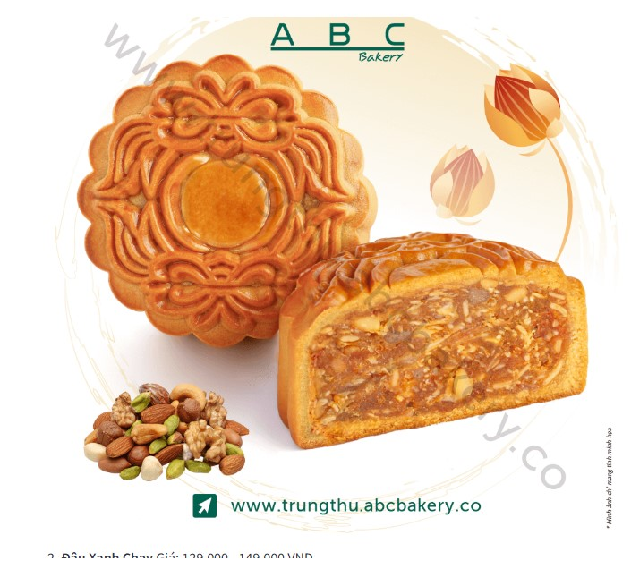
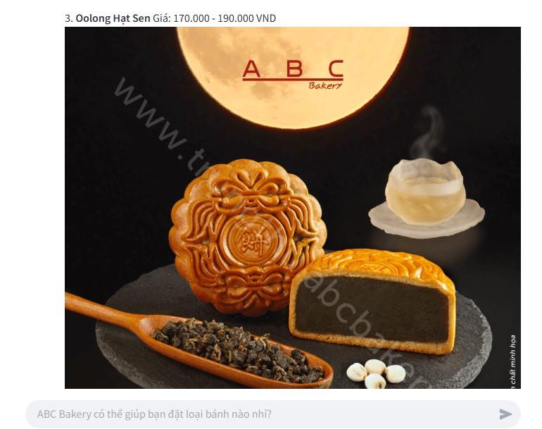
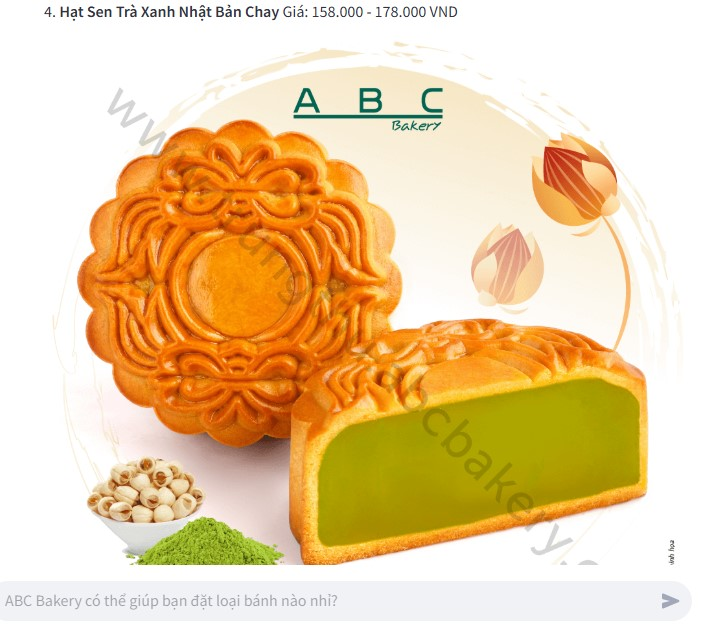
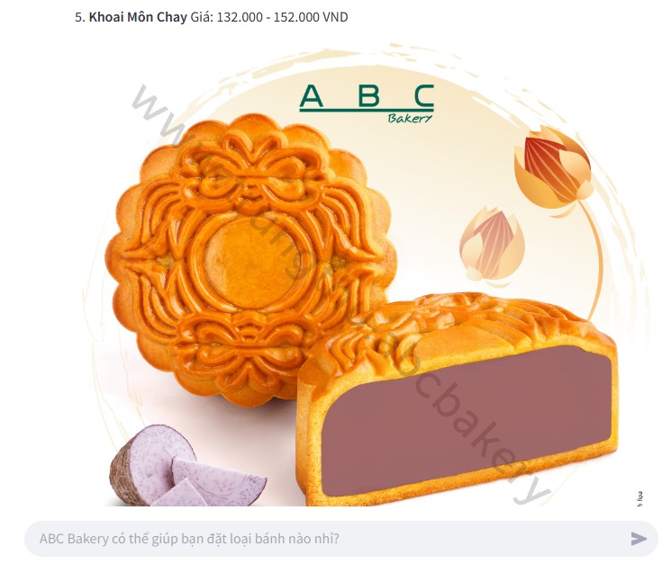

# RAG Bot Demo

## Introduction
This project is a demo chatbot that leverages advanced technologies such as Scrapy, OpenAI, Streamlit, ChromaDB, and Flask. The chatbot is capable of providing product-related information and handling casual chitchat through a web interface. It integrates **Retrieval-Augmented Generation (RAG)** and **Semantic Router** to efficiently process user queries.

The goal of this project is to create an intelligent virtual assistant that can:
- Answer product-related questions based on collected data.
- Engage in casual conversation (chitchat) with users.

## Technologies Used
The project employs the following technologies:
- **Scrapy**: A tool for scraping data from websites.
- **OpenAI**: Utilizes a large language model (LLM) like GPT-4o to generate responses.
- **Streamlit**: Builds a simple and user-friendly web interface.
- **ChromaDB**: A vector database for storing and retrieving embedded data (embeddings).
- **Flask**: Deploys a backend API to handle queries and responses.

## System Architecture
The chatbot system consists of the following key components:
1. **OpenAI Client and Embedding Model**:
   - Calls the OpenAI API to generate responses.
   - Uses a Sentence Transformer model to create vectors from text.
2. **ChromaDB - Vector Database**:
   - Stores product data as vectors, enabling semantic search.
3. **Retrieval-Augmented Generation (RAG)**:
   - Retrieves data from ChromaDB to provide accurate, context-aware answers.
   - Combines vector search with result ranking using `weighted_reciprocal_rank()`.
4. **Semantic Router**:
   - Classifies user queries into **chitchat** or **product** categories.
   - Routes product-related questions to RAG and chitchat questions directly to the LLM.
5. **Reflection**:
   - Stores conversation history to improve responses for similar queries.
6. **API Endpoint**:
   - Flask API handles queries via the `/api/v1/abc_bakery` endpoint.

## Results

